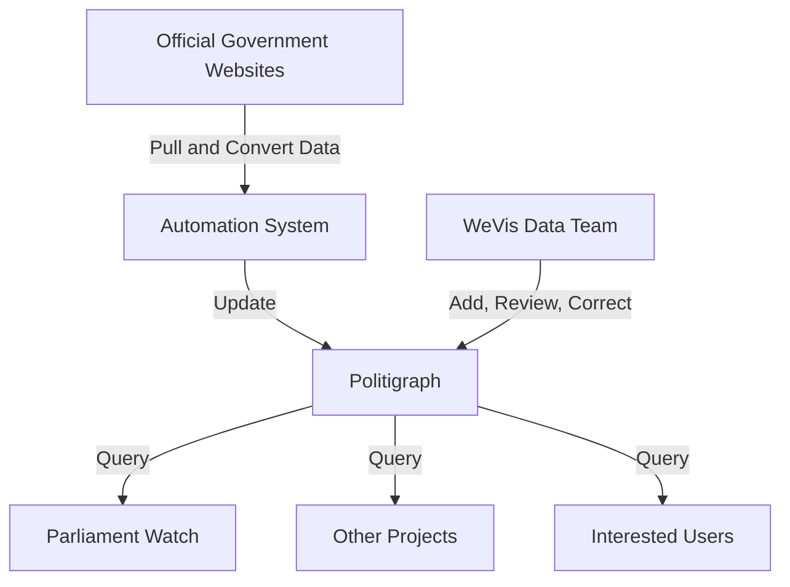
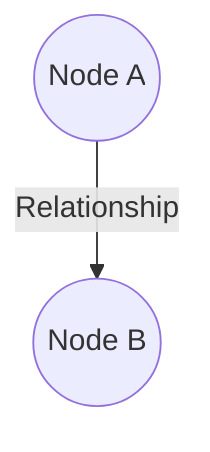

import QueryTabs from '../../../../components/query-tabs.astro';

The [WeVis](https://wevis.info) team has been working with data related to Thai politics for many years. We found that Thai open data is scattered, lacks standardized collection sources, and is often in difficult-to-use formats such as PDFs. Therefore, we created **"Politigraph"** to elevate the standards of Open Data and Open API in Thailand.

:::caution[We cannot be held responsible for any errors or consequences arising from the use of this data.]
We are not a government agency that directly owns and is responsible for publishing this data.
If you have any suggestions or feedback, please email team@wevis.info
or create a new issue on the project's [GitHub](https://github.com/wevisdemo/politigraph).
:::

## System Structure

We use an [Automation System](https://github.com/wevisdemo/politigraph-automation) to collect data from various official government sources, convert it into a machine-readable format, and have a team constantly reviewing its accuracy.

We intend to open Politigraph as a public database, allowing users and various projects to utilize the data. We believe that effective open data fosters innovation, supports civic participation, and builds a strong democratic society.

:::tip[For general users interested in the work of the Thai Parliament]
We recommend using [Parliament Watch](https://parliamentwatch.wevis.info),
a website that displays data from Politigraph in an easy-to-understand format.
:::

## Data in Graph Format

Politigraph store the data in the **"Graph"** structure which consists of

1. **"Node"** representing each entity in the database (has circle symbol). Each node have they own data called **"property"** such as a node representing person might have properties of first name, last name, birthdate, etc.

2. **"Relationship"** or sometimes called edge (has arrow symbol) representing a relationship between two nodes.

Due to the large number of nodes and relationships in Politigraph, we need to extract data for each point of interest. We call the code writing process to select nodes and relationships of interest **"query"** and the returned data **"response"**, which is in JSON format: machine-readable and convenient for further use. However, to make it easier to visualize, we will visualize the response in this documentation in the form of a graph.

For example, if we want to know _"Which vote event did Anutin Charnvirakul were agreeing with?"_ We can query a node representing him and the relationships that lead to the votes he were agreeing and the vote event.

<QueryTabs
	query="query People($where: PersonWhere, $votesWhere2: VoteWhere) { people(where: $where) { id name name_en image votes(where: $votesWhere2) { id option_en vote_events { id title nickname result start_date end_date } } } }"
	variables='{ "where": { "firstname_en": { "eq": "Anutin" }, "lastname_en": { "eq": "Charnvirakul" } }, "votesWhere2": { "option": { "eq": "เห็นด้วย" } } }'
/>
