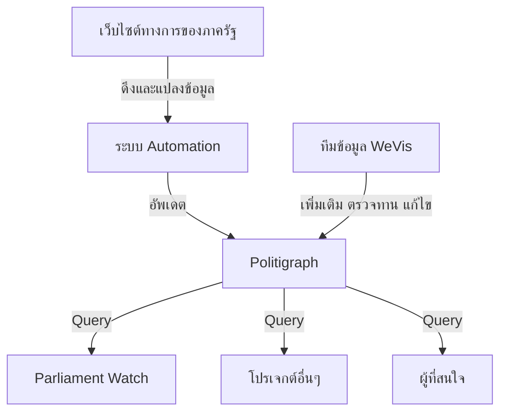
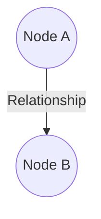

import QueryTabs from '../../../components/query-tabs.astro';

ทีม [WeVis](https://wevis.info) ได้ทำงานเกี่ยวกับข้อมูลที่เกี่ยวข้องกับการเมืองไทยมาหลายปี เราพบว่าข้อมูลเปิดของไทยนั้นกระจัดกระจาย ไม่มีแหล่งที่รวบรวมข้อมูลที่เป็นมาตรฐาน และอยู่ในรูปแบบที่ยากต่อการนำไปใช้เช่น PDF
เราเลยสร้าง **"Politigraph"** ขึ้นเพื่อยกระดับมาตรฐาน Open Data และ Open API ของประเทศไทย

:::caution[เราไม่สามารถรับผิดชอบข้อผิดพลาดหรือผลกระทบใดๆ จากการนำข้อมูลไปใช้]
เราไม่ใช่หน่วยงานภาครัฐที่เป็นเจ้าของและรับผิดชอบการเผยแพร่ข้อมูลเหล่านี้โดยตรง
หากมีข้อแนะนำหรือข้อเสนอแนะประการใด โปรดส่งอีเมล์มาที่ team@wevis.info
หรือสร้าง Issue ใหม่บน [GitHub](https://github.com/wevisdemo/politigraph) ของโปรเจกต์
:::

## โครงสร้างของระบบ

เราใช้ [ระบบ Automation](https://github.com/wevisdemo/politigraph-automation) ในการรวบรวมข้อมูลจากแหล่งข้อมูลทางการต่างๆ ของภาครัฐ แปลงให้อยู่ในรูปแบบ Machine-Readable
และมีทีมงานที่คอยตรวจทานความถูกต้องอย่างสม่ำเสมอ

เราตั้งใจเปิด Politigraph เป็นฐานข้อมูลสาธารณะ ให้ผู้ใช้และโปรเจกต์ต่างๆ ดึงข้อมูลไปใช้ต่อได้ เพราะเราเชื่อว่าข้อมูลแบบเปิดที่มีประสิทธิภาพจะช่วยเสริมสร้างนวัตกรรม
สนับสนุนการมีส่วนร่วมของภาคประชาชน และสร้างสังคมประชาธิปไตยที่แข็งแรง

:::tip[สำหรับผู้ใช้ทั่วไปที่สนใจข้อมูลเกี่ยวกับการทำงานของรัฐสภาไทย]
เราแนะนำให้ใช้ [Parliament Watch](https://parliamentwatch.wevis.info)
ซึ่งเป็นเว็บไซต์ที่นำข้อมูลจาก Politigraph ไปแสดงในรูปแบบที่เข้าใจง่าย
:::

## ข้อมูลในรูปแบบกราฟ

Politigraph เก็บข้อมูลในรูปแบบของ **"กราฟ (Graph)"** ซึ่งประกอบด้วย

1. **"Node"** แทน Entity ต่างๆ ในฐานข้อมูล (มีสัญลักษณ์เป็นวงกลม) ซึ่งในแต่ละ Node จะมีข้อมูลของตัวเองเรียกว่า **"Property"** เช่น Node ที่แทนข้อมูลบุคคลอาจจะมี Property ได้แก่ ชื่อ นามสกุล วันเกิด ฯลฯ

2. **"Relationship"** หรือบางครั้งก็ถูกเรียกว่า Edge (มีสัญลักษณ์เป็นลูกศร) ที่แสดงถึงความสัมพันธ์ระหว่าง Node เหล่านั้น

เนื่องจาก Node และ Relationship ใน Politigraph มีจำนวนเยอะมาก เราจึงต้องดึงข้อมูลออกมาในแต่ละประเด็นที่สนใจ เราจะเรียกการเขียน code เพื่อเลือก Node และ Relationship ที่สนใจว่า **"Query"** และเรียกข้อมูลที่ได้คืนกลับมาว่า **"Response"** ซึ่งอยู่ในรูปแบบ JSON ที่เป็น Machine-Readable สะดวกต่อการนำไปใช้ต่อ อย่างไรก็ตามเพื่อให้เห็นภาพได้ง่าย เราจะนำ Response ดังกล่าวมา Visualize ให้เห็นในรูปแบบกราฟ

ยกตัวอย่างเช่น ถ้าเราสงสัยว่า _"อนุทิน ชาญวีรกูล ได้เห็นด้วยกับการลงมติอะไรบ้าง?"_ เราก็สามารถดึง Node ของอนุทิน และ Relationships ที่เชื่อมไปถึงการโหวตเห็นด้วยจนถึงการลงมตินั้นๆ ได้

<QueryTabs
	query="query People($where: PersonWhere, $votesWhere2: VoteWhere) { people(where: $where) { id name image votes(where: $votesWhere2) { id option vote_events { id title nickname result start_date end_date } } } }"
	variables='{ "where": { "firstname": { "eq": "อนุทิน" }, "lastname": { "eq": "ชาญวีรกูล" } }, "votesWhere2": { "option": { "eq": "เห็นด้วย" } } }'
/>
